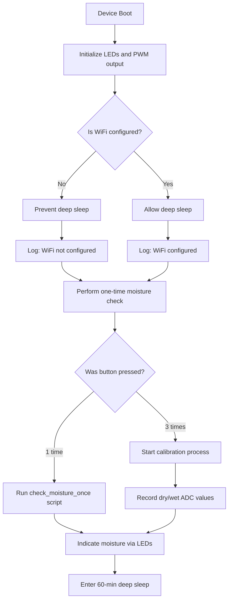

# XIAO Soil Moisture Monitor - ESPHome Configuration

## 1. Features

This ESPHome configuration implements the following features:

1. **Soil Moisture Measurement**
   - Uses the ADC on `D1` to read the voltage from a soil moisture sensor.
   - Based on calibrated dry/wet values, moisture is categorized into **Dry**, **Moderate**, and **Moist**.
   - The moisture status is shown via a text sensor in Home Assistant.
   - Moisture level is also indicated locally by color LEDs (Red/Yellow/Green).

2. **Button-Triggered Actions**
   - **Single Press**: Triggers a one-time moisture check and LED indication.
   - **Triple Press**: Starts the calibration process.

3. **Calibration Mode**
   - First, the red LED blinks while sampling the dry soil voltage;
   - Then, the green LED blinks while sampling the wet soil voltage;
   - The system compares the values and gives feedback via fast green (success) or red (fail) blinks.

4. **LED Status Indication**
   - Red: Soil is dry.
   - Yellow: Soil moisture is moderate.
   - Green: Soil is moist.
   - Includes slow/fast blinking scripts for feedback indication.

5. **PWM Output**
   - Outputs a 200kHz PWM signal on `D3` with 68% duty cycle by default, used in the soil moisture sensing circuit.

6. **Deep Sleep Functionality**
   - After boot and a moisture check, the device enters deep sleep for 60 minutes.
   - Wake-up is possible via the button.

7. **WiFi Status Detection**
   - If WiFi is not configured on first boot, deep sleep is prevented.
   - Once WiFi is successfully connected, deep sleep is allowed.

8. **Battery Monitoring**
   - Reads battery voltage from `D0`, converted into a percentage display.

9. **Home Assistant Integration**
   - Supports OTA updates, API communication, and WiFi fallback hotspot.

------

## 2. Variable Description

| Variable Name         | Type   | Description                                      | Notes                         |
|-----------------------|--------|--------------------------------------------------|-------------------------------|
| `dry_value`           | float  | Calibrated dry state ADC voltage                | Default: 2.75                 |
| `wet_value`           | float  | Calibrated wet state ADC voltage                | Default: 1.2                  |
| `soil_sensor`         | sensor | Raw voltage reading from soil sensor            | Connected to D1               |
| `soil_status`         | text   | Moisture level interpreted as dry/moderate/moist| Shown in Home Assistant       |
| `button_press_count`  | int    | Button press counter                             | Used to detect 1 or 3 presses |
| `wifi_net_status`     | int    | WiFi connection status                           | 0 = not connected, 1 = connected |
| `green_led`           | light  | Indicates moist condition                        | Connected to D8               |
| `yellow_led`          | light  | Indicates moderate condition                     | Connected to D10              |
| `red_led`             | light  | Indicates dry condition                          | Connected to D9               |
| `pwm_led`             | light  | 200kHz PWM output light                          | Connected to D3               |

------

## 3. Additional Information

### **ESP-IDF Version**

- Based on `ESP-IDF 5.2.1`, using PlatformIO version `6.6.0`;
- Flash size configured as `4MB`.

### **Pin Mapping**

| Pin   | Function                       |
|--------|-------------------------------|
| D0     | Battery ADC                   |
| D1     | Soil moisture sensor input    |
| D2     | Button input & wake-up pin    |
| D10    | Yellow LED                    |
| D8     | Green LED                     |
| D9     | Red LED                       |
| D3     | PWM output                    |

### **External Components**

- Uses the `adc` component from GitHub PR #7942;
- Loads `api` component from custom branch: `https://github.com/ackPeng/esphome.git` (`api` branch).

------

## 4. Function Flowchart

To better visualize the ESPHome workflow, the following flowchart shows the logic:

