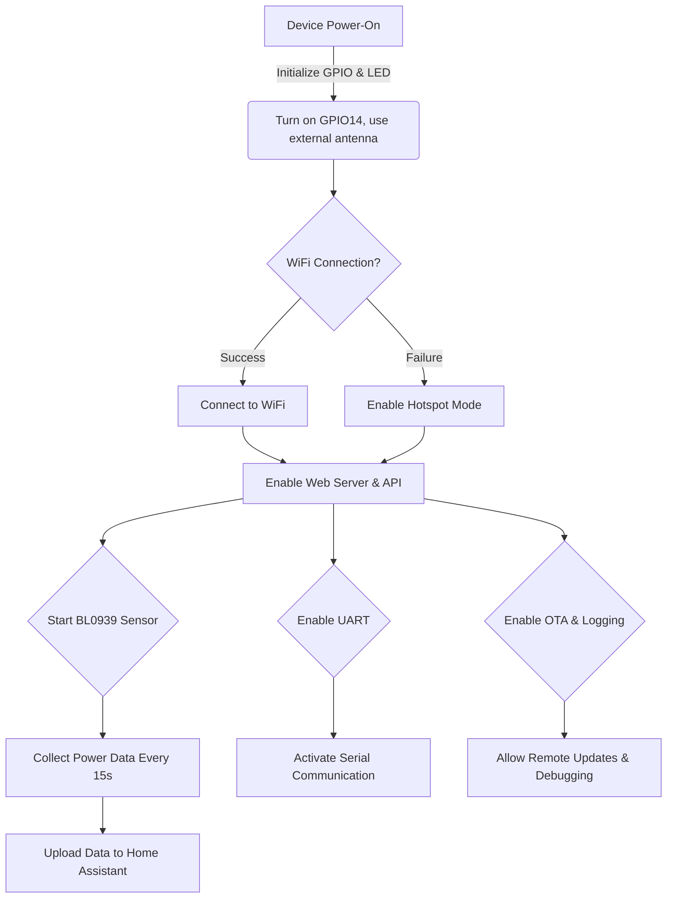

# SeeedStudio-2CH-EM - ESPHome Configuration

## 1. Implemented Features

This ESPHome configuration file implements the following features:

1. **GPIO Control**

   - `GPIO14` is set as a general output and is turned on by default at startup. It can use external antenna.
   - `GPIO19` is connected to a status indicator LED, which lights up at a low level.

2. **Status Indicator LED**

   - The LED connected to `GPIO19` is set as the `status LED` and remains **always on** (`ALWAYS_ON`).

3. **Power Measurement (BL0939 Sensor)**

   - Uses the

     ```
     BL0939
     ```

     sensor to obtain power parameters:

     - Voltage (`Voltage`)
     - Two current channels (`Current 1` & `Current 2`)
     - Two active power measurements (`Active Power 1` & `Active Power 2`)
     - Two energy consumption values (`Energy 1` & `Energy 2`)
     - Total energy consumption (`Energy Total`)

   - **Update Interval**: 15 seconds.

4. **WiFi Connection**

   - **Default AP Mode**: The device provides the hotspot `SeeedStudio-2CH-EM` without a password.
   - **Optional WiFi Connection** (Commented out, requires user configuration).
   - **Supports Captive Portal**, automatically entering hotspot mode if WiFi connection fails.

5. **Network Services**

   - **Web Server**: Listens on port `80`, supporting web access.
   - **Home Assistant API**: Allows connection to Home Assistant without a password.
   - **OTA Remote Updates**: Enables remote firmware updates.

6. **UART Serial Communication**

   - `GPIO16` (TX) and `GPIO17` (RX) are used for serial communication.
   - **Baud Rate**: `4800`, suitable for external device communication.

7. **Logging & Debugging**

   - **Logger (`logger`)**: Records runtime status for troubleshooting.
   - **Debugging (`debug`)**: Reserved for debugging, with no specific configuration yet.

------

## 2. Variable Description

| Variable Name          | Type     | Function                                          | Notes                                     |
| ---------------------- | -------- | ------------------------------------------------- | ----------------------------------------- |
| `gpio_14_output`       | `output` | Use external antenna                              | Turned on by default at startup           |
| `led_light`            | `output` | GPIO19 LED output                                 | Lights up at low level (`inverted: true`) |
| `status LED`           | `light`  | Binds to `led_light` as a status indicator        | Always on by default                      |
| `seeed_xiao_esp32c6`   | `board`  | Development board model                           | Uses ESP32-C6                             |
| `wifi_signal_strength` | `sensor` | WiFi signal strength measurement                  | Updates every 10 seconds                  |
| `bl0939`               | `sensor` | Collects voltage, current, power, and energy data | Updates every 15 seconds                  |

------

## 3. Additional Information

### **ESP-IDF Version**

- Developed using `ESP-IDF 5.2.1`, with PlatformIO version `6.6.0`.
- Configured Flash size: `4MB`.

### **External Components**

- Loads the `bl0939` component from `https://github.com/ackPeng/esphome.git` (`test` branch) for power monitoring. This branch extends the BL0939 current transformer mode to achieve higher precision in measurement. For more details about BL0939 current transformer mode, refer to the [documentation](https://www.belling.com.cn/media/file_object/bel_product/BL0939/guide/BL0939%20Notes_V1.1_cn.pdf).

------

## **Function Flowchart**

To visually demonstrate the ESPHome workflow, the following diagram illustrates the process:

